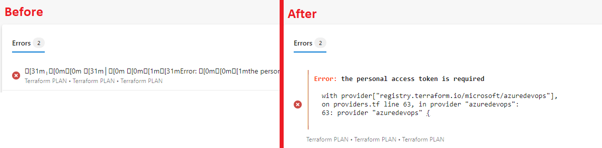
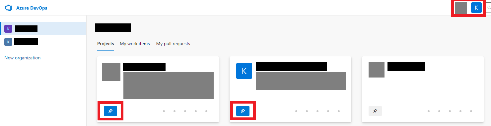
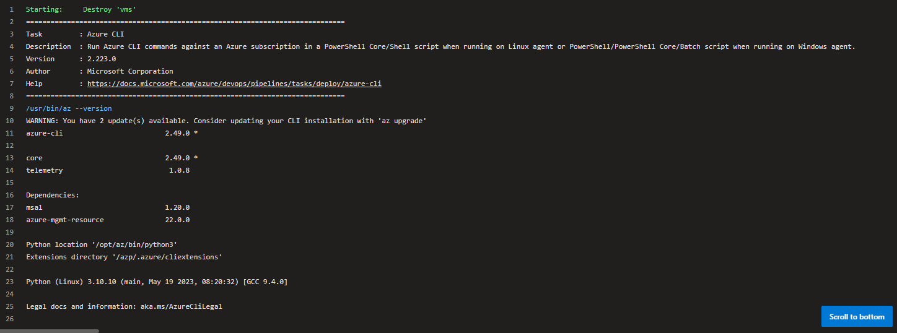
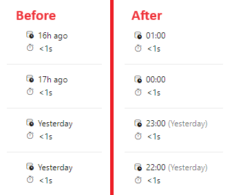

# AZDO Enhancer

A browser extension to fix up Azure DevOps so it sucks a little less.

Current features:

<b> Show ANSI errors correctly in pipeline status pages</b>

<b> Pin projects to the AZDO header for easy access</b>

<b> Scroll-to-bottom button for long logs</b>

<b> Format relative timestamps as absolute</b>

## Installation

Make sure Node and NPM are installed. Then:

<table><thead><tr><th>Chrome</th><th>Firefox</th></tr></thead>
<tbody><tr><td>

1. Download the repo
2. Run `npm install` and `npm run build`
3. Navigate to `chrome://extensions` in your browser and enable developer mode (toggle in top-right)
4. Click "Load unpacked" and choose the `dist` folder

</td><td>

1. Download the repo
1. Run `npm install` and `npm run build`
1. Manually remove the line containing `"use_dynamic_url": true` from `dist/manifest.json`
1. Navigate to `about:debugging#/runtime/this-firefox` (or go to `about:addons`, click the settings icon, and choose "Debug Add-ons")
1. Click "Load Temporary Add-on..." and choose the `dist/manifest.json` file.
1. Open Azure DevOps.
1. Click the extensions symbol in the taskbar (the puzzle piece), select the cog wheel next to AZDO Enhancer, and choose "Extension Can Read and Change Data: Always Allow on dev.azure.com"

</td>
