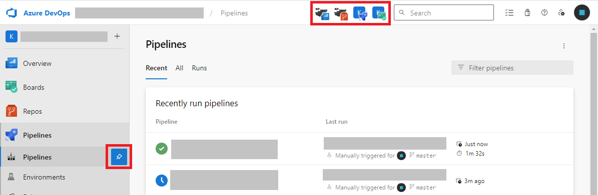

# AZDO Enhancer

A browser extension to fix up Azure DevOps so it sucks a little less.

Current features:

<b> Show ANSI errors correctly in pipeline status pages</b>

<b> Pin projects to the AZDO header for easy access</b>

